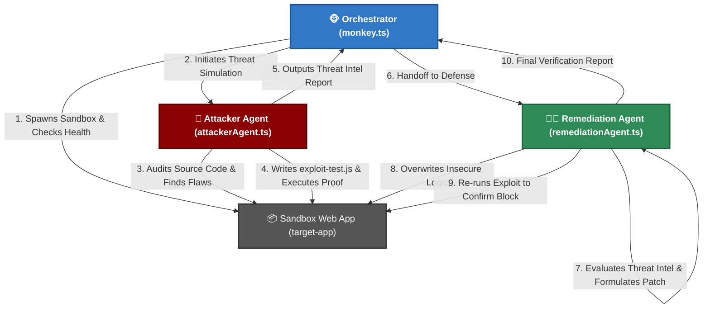

# 🐵 Chaos Security Monkey

<div align="center">
  <p><strong>Autonomous AI Multi-Agent Offensive Security Simulation & Automated Code Remediation</strong></p>
  
  
  
  
</div>

<br />

> **Chaos Security Monkey** is an advanced, autonomous DevSecOps simulation framework powered by the `@cursor/sdk`. It deploys a localized multi-agent AI system that sandboxes a web application, aggressively audits its source code for security vulnerabilities, generates physical exploit proof-of-concept scripts, and immediately formulates and applies robust defensive code patches.

---

## 🚀 System Architecture & Multi-Agent Workflow

The framework operates entirely locally on your machine, coordinating three dedicated AI subagents through a rigorous offensive-defensive feedback loop:



### 🤖 Meet the Core Agents

- 🐵 **Orchestrator (`monkey.ts`)**: The master controller. Manages process lifecycle, starts the sandboxed `target-app` server on port 5000, polls for application health, and handles the flawless handoff between attacker and remediation agents.
- 🥷 **Attacker Agent (`attackerAgent.ts`)**: The offensive penetration tester. Performs white-box source code auditing using Cursor AI models, locates injection flaws or broken access controls, writes standalone physical exploit scripts (`exploit-test.js`), and executes them to prove vulnerability viability.
- 👨‍⚕️ **Remediation Agent (`remediationAgent.ts`)**: The DevSecOps secure coding architect. Consumes threat intelligence reports, refactors vulnerable logic layers into modern defense-in-depth patterns (e.g., parameterized SQL queries, strict input length guards), and mathematically proves the fix by re-triggering the attacker's script and verifying failure.

---

## ⚡ Quick Start Guide

Follow these 4 simple steps to run the autonomous simulation on your local machine:

### 1. Prerequisites
Ensure you have **Node.js** (v20 or newer) installed.

### 2. Clone the Repository
```bash
git clone https://github.com/Ethiopian-Cursor-Community/Chaos-Security-Monkey.git
cd Chaos-Security-Monkey
npm install
```

### 3. Configure Environment Variables
Create a `.env` file in the root directory (or copy `.env.example`):
```env
CURSOR_API_KEY="your_cursor_api_key_here"
PORT=5000
```

### 4. Execute the Simulation
Run the master start script in your terminal:
```bash
npm start
```

---

## 💻 Live Demonstration Output Preview

When running `npm start`, you will witness the live streaming thought process of the AI agents in real time:

```text
🐵 [Orchestrator] Initialization Sequence Triggered.
[Orchestrator] Loading source file from target app path: ./target-app/server.js
[orchestrator] Starting target-app on port 5000...
[target-app] listening on http://localhost:5000
[orchestrator] Target ready at http://localhost:5000

🔥 [Orchestrator] Phase 1: Initializing Attacker Cyber Threat Simulation Loop...
[AttackerAgent] Auditing ./target-app/server.js for security vulnerabilities via Cursor SDK...
[AttackerAgent] Writing standalone exploit script to ./target-app/exploit-test.js...
[AttackerAgent] Executing 'node exploit-test.js'...

=================== EXPLOIT AUDIT SUMMARY ===================
- Vulnerability Type: SQL Injection
- Target Endpoint: GET /api/users/search
- Vulnerable Line of Code: const sql = `SELECT id ... WHERE username LIKE '%${q}%'`;
- Exploit Payload Used: ' OR 1=1-- 
- Exploit Proof Status: SUCCESS
=============================================================

🛠️ [Orchestrator] Phase 2: Exploit Confirmed. Triggering Remediation Subagent...
[RemediationAgent] Analyzing vulnerability report and refactoring source code via Cursor SDK...
[RemediationAgent] Clean code successfully written to ./target-app/server.js
[RemediationAgent] Executing verification test using 'exploit-test.js' against patched server...

=================== REMEDIATION AGENT RESULTS ===================
- Action Taken: Replaced string interpolation with parameterized SQL bindings (LIKE ?). Added input length guards.
- Security Verification: CONFIRMED PATCHED
==================================================================

🛑 [Orchestrator] Shutdown routine active. Killing sandboxed server instances...
```

---

## 📦 Sandbox Playground (`target-app`)

The repository includes a deliberately vulnerable standalone Node.js Express application inside `./target-app`. It features:
- **`better-sqlite3` / `sqlite3`** database drivers.
- Deliberate unparameterized SQL Injection routes.
- Broken Access Control headers for testing custom authentication bypasses.

> **Note on Git Cleanliness**: All generated databases (`*.db*`) and temporary exploit scripts (`exploit-test.js`) are strictly ignored in `.gitignore` to ensure the repository remains pristine across test runs.

---

## 🤝 Contribution & License

Contributions, feature requests, and bug reports are welcome! Feel free to open an issue or pull request on GitHub.

Distributed under the **ISC License**. See `package.json` for details.